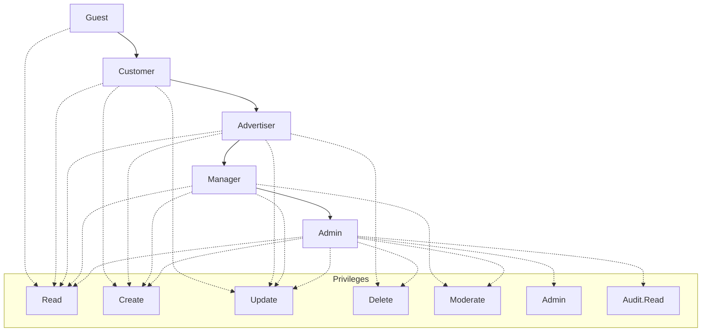
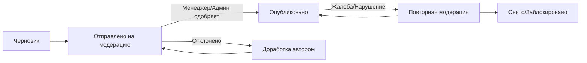
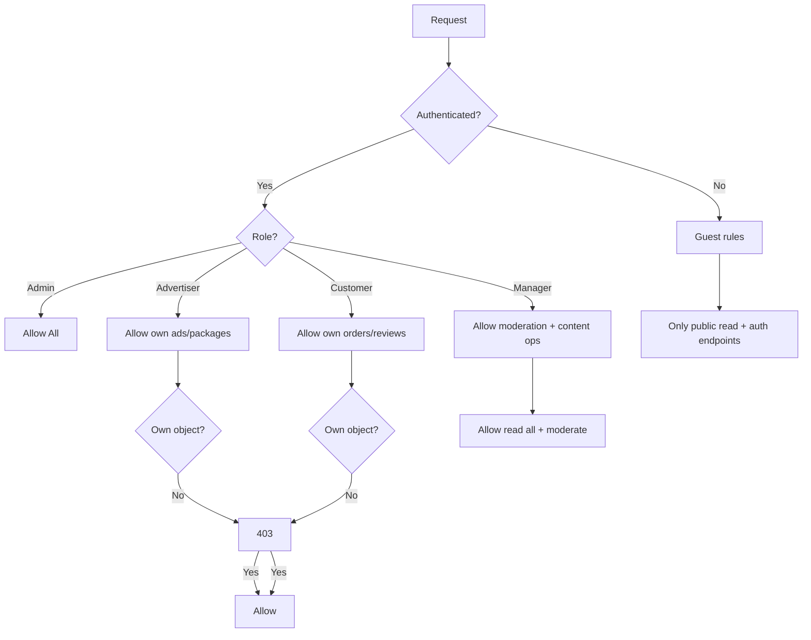

## Документ RBAC (Role-Based Access Control) для проекта “Магазин рекламы”

Версия: 1.0  
Дата: 2025-09-23  
Ответственный: Команда разработки SanderStu

### Цели и область применения
- Определить ролевую модель доступа к веб-приложению “Магазин рекламы” (клиент и REST API).
- Обеспечить безопасное разграничение прав: кто/что/когда имеет право выполнять.
- Обеспечить соответствие требованиям курсового проекта: RBAC, хранение паролей, аудит.

## Роли и их назначение
- Администратор (Admin): Полный контроль системы (пользователи, справочники, все данные).
- Менеджер (Manager): Операционное управление контентом рекламы и заявками клиентов.
- Рекламодатель (Advertiser): Создание и управление своими объявлениями и пакетами, отчеты.
- Клиент (Customer): Оформление заказов/заявок, отзывы; доступ к своему профилю/данным.
- Гость (Guest/Reader): Просмотр общего каталога, регистрация, запросы без аутентификации.

Дополнительно при необходимости: Аудитор (Auditor) — только чтение и доступ к журналу аудита.

## Объекты доступа (ресурсы)
- Категории рекламы: `Category`
- Рекламные предложения: `Ad`
- Пакеты рекламы: `Package`
- Заказы/Заявки: `Order`
- Отзывы: `Review`
- Пользователи/Роли: `User`, `Role`
- Вспомогательные: Конфигурация, Журнал аудита, Справочники

## Карта ролей → прав (уровень операций)
- Операции:
  - Read: просмотр (list/retrieve)
  - Create: создание
  - Update: обновление
  - Delete: удаление
  - Moderate: модерация/утверждение
  - Admin: управление пользователями/ролями/конфигурацией
  - Audit.Read: чтение аудита

### Матрица доступа (обобщенная)
- Администратор
  - Все ресурсы: Read, Create, Update, Delete, Moderate, Admin, Audit.Read
- Менеджер
  - Category: Read, Create, Update
  - Ad: Read, Create, Update, Moderate
  - Package: Read, Create, Update
  - Order: Read, Update (смена статусов), Moderate
  - Review: Read, Moderate
  - User: Read ограниченно (профили клиентов по заявкам)
- Рекламодатель
  - Ad: Read, Create, Update, Delete — только собственные
  - Package: Read, Create, Update, Delete — собственные
  - Order: Read — только относящиеся к его объявлениям (обезличенно, без PII клиента) или агрегаты
  - Review: Read; Moderate — только по своим объявлениям (скрыть/пожаловаться для модерации)
- Клиент
  - Order: Read/Create/Update/Delete — только собственные (черновики/отмены); Update статусов ограниченно (например, отмена)
  - Review: Read/Create/Update/Delete — только свои отзывы; Update/Delete в пределах окна и правил модерации
  - Ad/Package/Category: Read
  - Profile: Read/Update — свой профиль
- Гость
  - Ad/Package/Category: Read (только активные)
  - Auth: регистрация/логин/сброс пароля
  - Order: Create (минимальная форма запроса) — опционально, с валидацией Anti-Spam

## Диаграммы (Mermaid)

### Иерархия ролей и привилегий

### Поток модерации объявлений/отзывов

## Политики на уровне данных (Row-Level)
- Ограничения видимости:
  - Рекламодатель видит/редактирует только свои `Ad`, `Package`.
  - Клиент видит свои `Order`, свои `Review`.
  - Менеджер видит все `Order`, все `Ad` (для модерации).
  - Гость видит только активные `Ad/Package/Category` (is_active=True).
- PII (персональные данные):
  - Рекламодатель может видеть агрегаты заказов по своим объявлениям без PII пользователя (имя/email/телефон скрыты или маскированы).
  - Менеджер/Админ — полный доступ для обработки заявок.

## Политики на уровне полей (Field-Level)
- Пользователь (Customer):
  - `email`, `phone` только сам пользователь, Менеджер, Админ.
  - Пароль никогда не возвращается.
- Объявления (Ad):
  - Поля модерации (например, `is_active`, `moderation_status`) — только Менеджер/Админ.
- Заказы (Order):
  - Поле `status` — Менеджер/Админ; клиент может сменить на “cancelled”, пока не “in_progress”.

## Политики на уровне операций (Workflow)
- Создание объявления:
  - Рекламодатель создает → статус “draft” → отправляет на модерацию → Менеджер/Админ утверждает → “active”.
- Отзывы:
  - Клиент добавляет → автоматическая проверка (антиспам/ограничение по частоте) → публикуется или уходит на модерацию.
- Заказы:
  - Клиент создает → Менеджер обрабатывает (меняет статус: new → in_progress → done/cancelled).

## Правила для REST API (эндпоинты)
- Публичные (Guest):
  - GET `/api/categories/` (только активные)
  - GET `/api/ads/` (только активные, без скрытых полей)
  - GET `/api/packages/` (только активные)
  - POST `/api/auth/register/`, POST `/api/auth/login/`
- Клиент (Customer) — с токеном:
  - GET/POST `/api/orders/` — свои; PATCH/DELETE — свои (с ограничениями статусов)
  - GET/POST `/api/reviews/` — чтение всех, создание; PATCH/DELETE — свои
  - GET/PATCH свой профиль `/api/me/`
- Рекламодатель (Advertiser):
  - GET/POST/PATCH/DELETE `/api/ads/` — только свои объекты
  - GET/POST/PATCH/DELETE `/api/packages/` — свои
  - Агрегаты заказов по своим объявлениям `/api/ads/{id}/orders/summary` без PII
- Менеджер (Manager):
  - Полный Read всех объектов, Create/Update `Category`, `Ad` (модерация), `Package`
  - Update `Order.status`, Moderate `Review`
- Администратор (Admin):
  - Полный CRUD всех ресурсов
  - Управление пользователями/ролями `/api/admin/users/`, `/api/admin/roles/`
  - Доступ к аудиту `/api/admin/audit/`

## Модель аутентификации и сессий
- Поддержка:
  - Token Auth (DRF Token): для API клиентов/интеграций.
  - Session Auth: для админки/веб-панели.
- Хранение паролей: безопасные хэши (Django `PBKDF2` по умолчанию).
- Политика паролей: мин. 8 символов, сложность (буквы/цифры), блокировка при частых неудачных попытках (рекомендовано через throttling/сторонний пакет).
- Throttling:
  - `anon`: базовое ограничение на POST регистраций/логина
  - `user`: лимиты на создание отзывов/заказов (антиспам)

## Аудит и журналирование
- События аудита:
  - CRUD по критичным моделям: `Ad`, `Order`, `Review`, `User`.
  - Смена ролей/прав.
  - Модерация (approve/reject), блокировки.
- Запись:
  - Таблица `AuditLog` (action, actor_id, object_type, object_id, before, after, ts, ip, ua).
- Доступ:
  - Audit.Read: Admin; агрегированные отчеты — Manager (без персональных данных, где применимо).
- Retention: хранение журналов min 6-12 мес.

## Защита данных
- PII поля (`email`, `phone`):
  - Доступ строго по ролям; маскирование при необходимости.
- Защита от SQL-инъекций: ORM, параметризованные запросы.
- CSRF: включено для форм; для API — только для session auth.
- CORS/CSRF/HTTPS: включить в production; секреты — через ENV.

## Разделение обязанностей (SoD)
- Менеджер не управляет ролями/пользователями.
- Рекламодатель не видит PII клиентов.
- Администратор может делегировать права, но не модерацию содержимого в обход процесса (рекомендовано использовать workflow).

## Тестирование RBAC (минимальный набор)
- Администратор:
  - Может управлять пользователями/ролями, видеть аудит.
- Менеджер:
  - Может утверждать объявления; не может менять роли пользователей.
- Рекламодатель:
  - Не может редактировать чужие объявления и видеть PII заказов.
- Клиент:
  - Имеет доступ только к своим заказам/отзывам.
- Гость:
  - Не может создавать/редактировать приватные данные.
- Негативные кейсы:
  - Попытка доступа к чужим ресурсам → 403/404.
  - Попытка эскалации прав через параметры запроса → отклонено.
- Логи аудита фиксируют кто/что/когда.

## План внедрения
- Модель ролей:
  - Использовать `is_staff`, `is_superuser` для Admin; для остальных — группы Django: `manager`, `advertiser`, `customer`.
- Пермишены:
  - DRF `IsAuthenticated`, `DjangoModelPermissions`, кастомные пермишены (проверка владельца объекта, модерации).
- Фильтрация по владельцу:
  - QuerySet ограничения по текущему пользователю.
- Политики полей:
  - Сериализаторы с `read_only` и условной сериализацией по ролям.

## Пример соответствия ролей группам Django
- Группы:
  - `manager`: объектные права на модерацию и редактирование справочников.
  - `advertiser`: объектные права на `Ad`/`Package` только для своих.
  - `customer`: базовые права на `Order`/`Review` только для своих.
- Назначение:
  - Через админку или команду управления пользователями.

## Пример пермишенов (логика, псевдокод)

## Открытые вопросы/дополнения
- Нужен ли отдельный “Аудитор” (только Audit.Read)?
- Требуется ли модерация отзывов до публикации?
- Нужен ли SLA на время модерации?
- Нужны ли кастомные статусы заказов и их автоматические переходы?

## Приложения
- Спецификация API (OpenAPI) — подготовить отдельно после финализации RBAC.
- Инструкция по запуску — в README.
- План резервного копирования/восстановления — в документе по администрированию.

