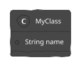

# 📊 Диаграммы в Visual Studio Code

## 🚀 Быстрая установка PlantUML

### Шаг 1: Установка расширения

1. Откройте VS Code
2. Нажмите `Cmd+Shift+X` (macOS) или `Ctrl+Shift+X` (Windows/Linux)
3. Введите в поиске: **"PlantUML"**
4. Установите расширение **"PlantUML"** от jebbs

### Шаг 2: Установка Java (если нужно)

PlantUML требует Java для работы. Проверьте:

```bash
java -version
```

Если Java не установлена:

**macOS (с Homebrew):**
```bash
brew install openjdk@17
```

**Windows:**
Скачайте и установите с [java.com](https://www.java.com/)

**Linux (Ubuntu/Debian):**
```bash
sudo apt-get install default-jre
```

### Шаг 3: Используйте готовые диаграммы!

Созданы для вас файлы в папке `diagrams/`:

## 📁 Доступные диаграммы

### 1. Диаграмма классов
📄 `diagrams/class_diagram.puml`

**Как открыть:**
1. Откройте файл `class_diagram.puml` в VS Code
2. Нажмите `Alt+D` или щёлкните на кнопку "Preview" справа вверху
3. Диаграмма отобразится в правой панели!

### 2. ER-диаграмма
📄 `diagrams/er_diagram.puml`

**Как открыть:**
1. Откройте файл `er_diagram.puml`
2. Нажмите `Alt+D` для предпросмотра
3. Видите все связи между таблицами!

## 🎯 Как использовать

### Предпросмотр диаграммы

**Способ 1: Автопредпросмотр**
1. Откройте `.puml` файл
2. Нажмите `Alt+D` или `Cmd+Shift+P` → "PlantUML: Preview"
3. Диаграмма откроется справа

**Способ 2: Предпросмотр в браузере**
1. Откройте `.puml` файл
2. Нажмите `Cmd+Shift+P` (macOS) или `Ctrl+Shift+P` (Windows)
3. Выберите **"PlantUML: Preview Current Diagram"**
4. Откроется браузер с диаграммой

### Экспорт диаграммы

**Экспорт в PNG:**
1. Откройте `.puml` файл
2. Нажмите `Cmd+Shift+P` → **"PlantUML: Export Current Diagram"**
3. Выберите формат (PNG, SVG, PDF)
4. Сохраните файл

**Или через Command Palette:**
- `Cmd+Shift+P` → "PlantUML: Export Current Diagram to PNG"

## 💡 Горячие клавиши

| Действие | macOS | Windows/Linux |
|----------|-------|----------------|
| Предпросмотр | `Alt+D` | `Alt+D` |
| Экспорт | `Cmd+Shift+P` | `Ctrl+Shift+P` |
| Открыть панель команд | `Cmd+Shift+P` | `Ctrl+Shift+P` |

## 📝 Редактирование диаграмм

### Синтаксис PlantUML

**Класс:**
```plantuml
class MyClass {
  + String name
  + void method()
}
```

**Отношение:**
```plantuml
Class1 "1" -- "N" Class2
```

**Комментарии:**
```plantuml
' Это комментарий
note right of Class1
  Это заметка
end note
```

### Группировка классов
```plantuml
package "Package Name" {
  class MyClass
  class AnotherClass
}
```

## 🎨 Темы и стили

### Изменение темы

В начале `.puml` файла:
```plantuml
!theme <theme_name>
```

**Доступные темы:**
- `plain` (по умолчанию)
- `cerulean`
- `sketchy`
- `cerulean-outline`

### Пример:


## 🔧 Устранение проблем

### Проблема: Диаграмма не отображается

**Решение 1:** Проверьте Java
```bash
java -version
```

**Решение 2:** Перезапустите VS Code
1. Закройте VS Code полностью
2. Откройте снова

**Решение 3:** Переустановите расширение
1. Удалите расширение PlantUML
2. Перезапустите VS Code
3. Установите снова

### Проблема: "PlantUML server not responding"

**Решение:**
1. Откройте настройки VS Code
2. Найдите "PlantUML"
3. Включите "PlantUML: Server"
4. Или используйте локальный рендер

## 📚 Полезные команды в VS Code

### Command Palette (Cmd+Shift+P)

- **PlantUML: Preview Current Diagram** - предпросмотр
- **PlantUML: Export Current Diagram** - экспорт
- **PlantUML: Export All Diagrams** - экспортировать все
- **PlantUML: Reset Server** - сбросить сервер

## 🎓 Примеры использования

### Пример 1: Быстрый просмотр

1. Откройте `diagrams/class_diagram.puml`
2. Нажмите `Alt+D`
3. ✅ Диаграмма показывается справа!

### Пример 2: Экспорт в PNG

1. Откройте любую `.puml` диаграмму
2. `Cmd+Shift+P` → "PlantUML: Export Current Diagram"
3. Выберите "PNG" и сохраните

### Пример 3: Экспорт всех диаграмм

1. Откройте любую `.puml` файл
2. `Cmd+Shift+P` → "PlantUML: Export All Diagrams in Workspace"
3. Все диаграммы экспортируются в `diagrams/puml-output/`

## 🌟 Совет от профессионала

**Лучший workflow:**
1. Откройте `.puml` файл
2. Работайте с предпросмотром (`Alt+D` справа)
3. Редактируйте код слева, видите результат справа
4. Когда готово → экспортируйте в PNG/PDF

## 📂 Структура файлов

```
diagrams/
├── class_diagram.puml      # Диаграмма классов
├── er_diagram.puml         # ER-диаграмма
├── index.html              # HTML версия (браузер)
├── simple_diagrams.html    # Упрощённая версия
└── *.md                    # Markdown документация
```

## 🎯 Что дальше?

1. ✅ Установите расширение PlantUML в VS Code
2. ✅ Откройте `diagrams/class_diagram.puml`
3. ✅ Нажмите `Alt+D` для предпросмотра
4. ✅ Редактируйте и экспортируйте по необходимости!

## 🔗 Полезные ссылки

- [PlantUML Documentation](https://plantuml.com/)
- [PlantUML VS Code Extension](https://marketplace.visualstudio.com/items?itemName=jebbs.plantuml)
- [PlantUML Syntax Guide](https://plantuml.com/guide)

---

💡 **Совет:** Используйте `Cmd+\` чтобы разделить окна и видеть код и диаграмму одновременно!

