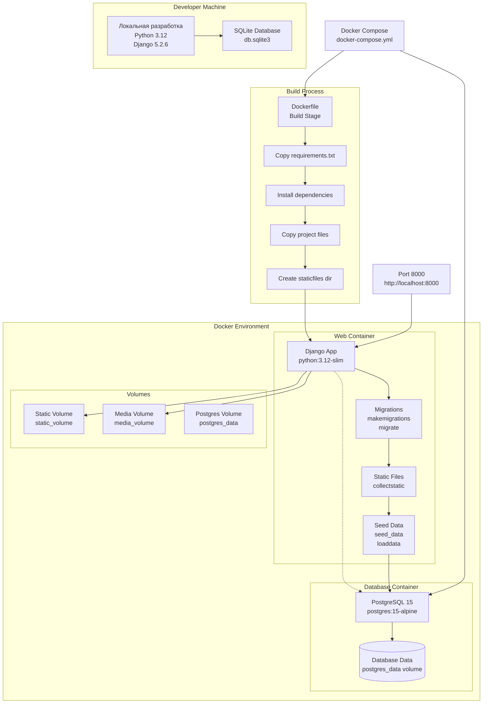
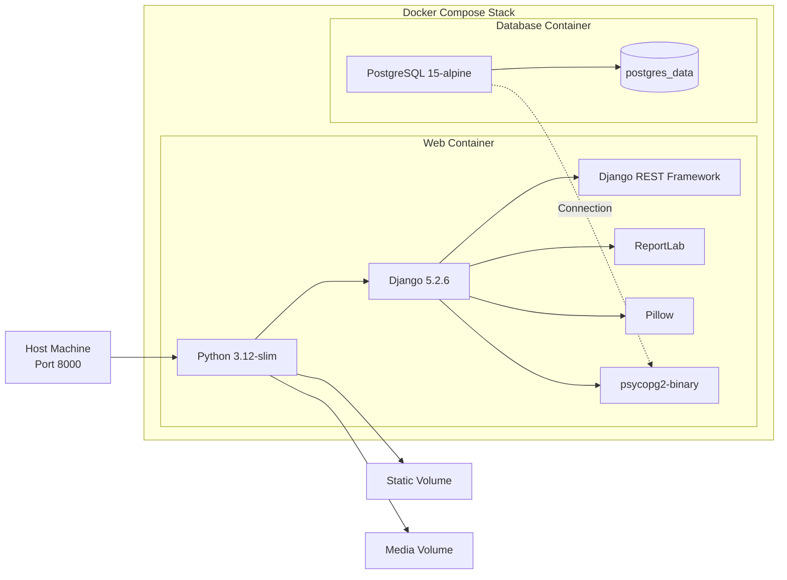
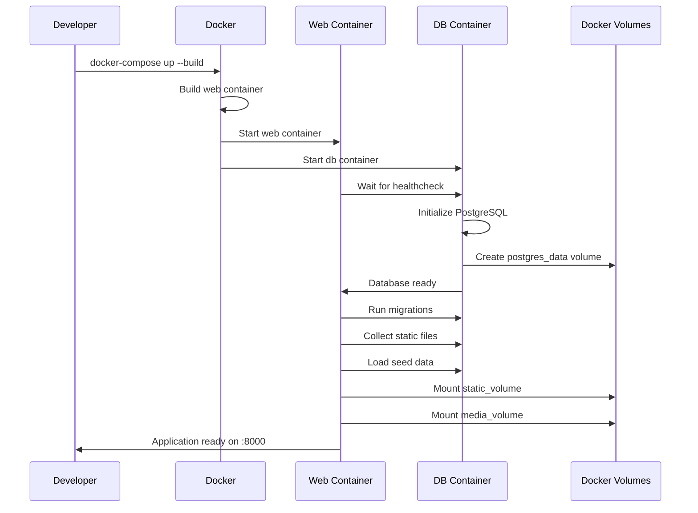
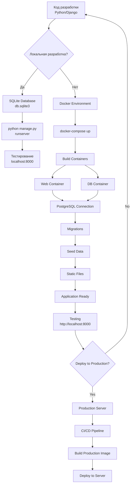
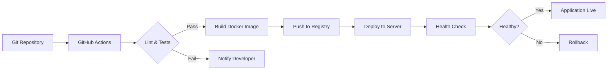
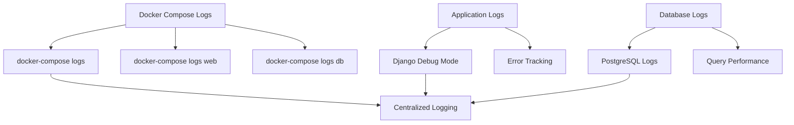
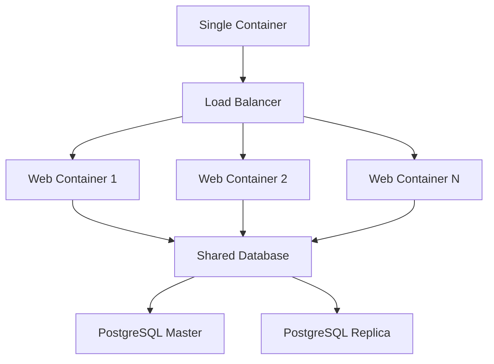

# DevOps диаграмма системы SanderStu

## CI/CD Pipeline

```mermaid
graph TB
    subgraph Dev["🔵 Этап разработки"]
        Dev1["👥 Разработчики<br/>Django + Python<br/>Django REST Framework"]
        Dev2["📦 Git Repository<br/>Version Control<br/>GitHub/GitLab"]
        Dev3["👀 Code Review<br/>Pull Requests<br/>Team Review"]
        
        Dev1 --> Dev2
        Dev2 --> Dev3
    end
    
    subgraph CI["🟢 Continuous Integration"]
        CI1["⚡ CI Trigger<br/>Git Push/Merge<br/>Webhook"]
        CI2["🧪 Тестирование<br/>• Unit тесты<br/>• Migrations БД<br/>• Code Quality"]
        CI3["🔨 Сборка<br/>• Docker Build<br/>• PostgreSQL Setup<br/>• Static Files"]
        CI4["🔒 Безопасность<br/>• SAST/DAST<br/>• Dependency Scan<br/>• DB Config Check"]
        CI5["📦 Артефакты<br/>• Docker Images<br/>• Migration Files<br/>• Test Reports"]
        
        CI1 --> CI2
        CI2 --> CI3
        CI3 --> CI4
        CI4 --> CI5
    end
    
    subgraph CD["🟡 Continuous Deployment"]
        CD1{"✅ Ручное подтверждение<br/>Deploy to Production"}
        CD2["🧪 Staging Environment<br/>• Auto Deploy<br/>• Integration Tests<br/>• DB Migration Test"]
        CD3["🚀 Production Environment<br/>• Blue-Green Deploy<br/>• PostgreSQL Cluster<br/>• Load Balancer"]
        CD4[("💾 PostgreSQL Database<br/>• Auto Migrations<br/>• Backup/Restore<br/>• Monitoring")]
        CD5["📊 Мониторинг<br/>• Application Logs<br/>• Performance Metrics<br/>• Error Tracking"]
        
        CD1 --> CD2
        CD2 --> CD3
        CD3 --> CD4
        CD4 --> CD5
    end
    
    Dev3 -->|Triggers| CI1
    CI5 -->|Artifacts| CD1
    CD5 -.->|Feedback| Dev1
    
    style Dev fill:#e1f5ff,stroke:#01579b,stroke-width:2px
    style CI fill:#e8f5e9,stroke:#2e7d32,stroke-width:2px
    style CD fill:#fff9e6,stroke:#f57f17,stroke-width:2px
    style Dev1 fill:#b3e5fc
    style Dev2 fill:#fff9c4
    style Dev3 fill:#ffccbc
    style CI1 fill:#c5e1a5
    style CI2 fill:#a5d6a7
    style CI3 fill:#ffcc80
    style CI4 fill:#ffccbc
    style CI5 fill:#fff9c4
    style CD1 fill:#fff9c4
    style CD2 fill:#c5e1a5
    style CD3 fill:#b3e5fc
    style CD4 fill:#ffccbc
    style CD5 fill:#e1bee7
```



## Описание этапов CI/CD Pipeline

### 🔵 Этап разработки (Development Stage)

**Цель:** Разработка и версионирование кода

1. **Разработчики** - работают с Django + Python, создают функционал системы SanderStu
2. **Git Repository** - версионирование кода через Git (GitHub/GitLab)
3. **Code Review** - проверка кода командой перед merge в main

**Технологии:**
- Django 5.2.6, Python 3.12
- Django REST Framework для API
- PostgreSQL для разработки
- Git для контроля версий

### 🟢 Continuous Integration (CI)

**Цель:** Автоматическая проверка и сборка кода

1. **CI Trigger** - автоматический запуск при push/merge кода
2. **Тестирование** - проверка юнит-тестов, миграций БД, качества кода
3. **Сборка** - создание Docker образа, настройка PostgreSQL, сбор статики
4. **Безопасность** - сканирование на уязвимости (SAST/DAST), проверка зависимостей
5. **Артефакты** - сохранение Docker образов, файлов миграций, отчетов тестов

**Автоматизация:**
- Проверка проходит при каждом PR
- При успехе - готовые артефакты для деплоя
- При ошибках - уведомление разработчиков

### 🟡 Continuous Deployment (CD)

**Цель:** Развертывание в staging и production

1. **Ручное подтверждение** - одобрение для деплоя в production
2. **Staging Environment** - автоматический деплой, интеграционные тесты, проверка миграций
3. **Production Environment** - Blue-Green развертывание, PostgreSQL кластер, Load Balancer
4. **PostgreSQL Database** - автоматические миграции, бэкапы, мониторинг БД
5. **Мониторинг** - логи приложения, метрики производительности, отслеживание ошибок

**Особенности:**
- Blue-Green деплой для нулевого даунтайма
- Автоматические бэкапы БД
- Мониторинг в реальном времени
- Feedback loop для разработчиков

## Архитектура развертывания



## Структура Docker контейнеров



## Процесс развертывания



## Процесс разработки и деплоя



## Информационные панели

<details>
<summary><strong>🔵 Этап разработки</strong> - Технологический стек</summary>

### Технологический стек SanderStu

| Компонент | Технология | Версия | Назначение |
|-----------|-----------|--------|------------|
| **Backend** | Django + Python | 5.2.6 / 3.12 | Основной фреймворк |
| **API** | Django REST Framework | 3.15.1 | REST API |
| **Database** | PostgreSQL | 15-alpine | База данных |
| **Frontend** | HTML/CSS/JavaScript | - | Клиентская часть |
| **Auth** | JWT (Simple JWT) | 5.3.1 | Аутентификация |
| **PDF** | ReportLab | 4.0.9 | Генерация отчетов |
| **Images** | Pillow | 10.2.0 | Обработка изображений |
| **CI/CD** | GitHub Actions / GitLab CI | - | Автоматизация |
| **Container** | Docker + Docker Compose | - | Контейнеризация |
| **Monitoring** | Custom Logs + Sentry (plan) | - | Мониторинг |

**Среда разработки:**
- Python 3.12
- Django 5.2.6
- Docker Desktop
- Git для версионирования

</details>

<details>
<summary><strong>🟢 Continuous Integration</strong> - Безопасность</summary>

### Меры безопасности

| Категория | Инструмент/Метод | Описание |
|-----------|-----------------|----------|
| **SAST/DAST Scanning** | Bandit / Snyk | Статический анализ кода на уязвимости |
| **Dependency Checks** | Safety / Dependabot | Проверка зависимостей на CVE |
| **DB Configuration** | Environment Variables | Безопасное хранение секретов БД |
| **Secret Management** | Docker Secrets / Vault | Управление ключами и паролями |
| **SSL Certificates** | Let's Encrypt | HTTPS для production |
| **Authentication** | JWT с коротким TTL | Безопасные токены доступа |
| **Authorization** | RBAC система | Ролевой контроль доступа |
| **Password Policy** | Django validators | Надежные пароли |
| **CSRF Protection** | Django CSRF middleware | Защита от CSRF атак |

**Примеры проверок:**
- SQL Injection тестирование
- XSS уязвимости
- Зависимости с известными CVE
- Конфигурация базы данных
- Проверка переменных окружения

</details>

<details>
<summary><strong>🟡 Continuous Deployment</strong> - Мониторинг</summary>

### Мониторинг системы SanderStu

| Метрика | Инструмент | Цель |
|---------|-----------|------|
| **Application Logs** | Django Logging / Filebeat | Логирование запросов и ошибок |
| **Performance Metrics** | Custom Middleware | Время ответа, запросы в секунду |
| **Error Tracking** | Sentry (planned) | Отслеживание исключений в production |
| **Database Health** | PostgreSQL stats | Здоровье БД, slow queries |
| **User Activity** | Django sessions | Активность пользователей |
| **API Usage** | Custom analytics | Популярные эндпоинты |
| **Uptime** | Health checks | Доступность сервиса |
| **Alerts** | Email / Slack notifications | Критические ошибки |

**Мониторинг включает:**
- Response time < 500ms (p95)
- Error rate < 0.1%
- Database connection pool
- Disk usage на серверах
- Memory consumption
- Active users per hour

</details>

## Таблица компонентов DevOps

| Компонент | Технология | Назначение | Конфигурация |
|-----------|-----------|------------|--------------|
| **Base Image** | python:3.12-slim | Базовый образ Python | Python 3.12, минимальный размер |
| **Database** | postgres:15-alpine | База данных | PostgreSQL 15, Alpine Linux |
| **Web Framework** | Django 5.2.6 | Основной фреймворк | Django с REST API |
| **API Framework** | DRF 3.15.1 | REST API | Django REST Framework |
| **Database Driver** | psycopg2-binary | PostgreSQL драйвер | Версия 2.9.9 |
| **PDF Generation** | ReportLab 4.0.9 | Генерация отчетов | PDF export для менеджеров |
| **Image Processing** | Pillow 10.2.0 | Обработка изображений | Обработка медиа файлов |
| **Authentication** | JWT 5.3.1 | JWT токены | Simple JWT |

## Volumes и данные

| Volume | Назначение | Маппинг | Персистентность |
|--------|-----------|---------|----------------|
| **postgres_data** | PostgreSQL данные | `/var/lib/postgresql/data` | Сохраняется между перезапусками |
| **static_volume** | Статические файлы | `/app/staticfiles` | Собирается при сборке |
| **media_volume** | Медиа файлы | `/app/media` | Загружаемые пользователями файлы |

## Порты и сеть

| Сервис | Порт | Протокол | Доступ |
|--------|------|----------|--------|
| **Web Container** | 8000 | HTTP | http://localhost:8000 |
| **Database** | 5432 | PostgreSQL | Внутренняя сеть Docker |
| **Admin Panel** | 8000/admin | HTTP | http://localhost:8000/admin/ |
| **API** | 8000/api/v2/ | HTTP | http://localhost:8000/api/v2/ |

## Основные команды

### Локальная разработка (без Docker)

```bash
# Установка зависимостей
pip install -r requirements.txt

# Миграции
python manage.py migrate

# Создание тестовых данных
python manage.py seed_data

# Запуск сервера
python manage.py runserver
```

### Docker развертывание

```bash
# Сборка и запуск
docker-compose up --build

# Запуск в фоне
docker-compose up -d --build

# Остановка
docker-compose down

# Остановка с удалением данных
docker-compose down -v

# Просмотр логов
docker-compose logs -f web

# Исполнение команд
docker-compose exec web python manage.py shell
docker-compose exec db psql -U sanderstu sanderstu
```

### Работа с базой данных

```bash
# Миграции
docker-compose exec web python manage.py makemigrations
docker-compose exec web python manage.py migrate

# Создание суперпользователя
docker-compose exec web python manage.py createsuperuser

# Экспорт данных
docker-compose exec db pg_dump -U sanderstu sanderstu > backup.sql

# Импорт данных
cat backup.sql | docker-compose exec -T db psql -U sanderstu sanderstu

# Django shell
docker-compose exec web python manage.py shell
```

## CI/CD Pipeline (предполагаемый)



## Переменные окружения

| Переменная | Значение | Описание |
|-----------|----------|----------|
| `DEBUG` | `True/False` | Режим отладки Django |
| `USE_POSTGRES` | `true` | Использование PostgreSQL |
| `POSTGRES_DB` | `sanderstu` | Имя базы данных |
| `POSTGRES_USER` | `sanderstu` | Пользователь БД |
| `POSTGRES_PASSWORD` | `sanderstu123` | Пароль БД |
| `POSTGRES_HOST` | `db` | Хост БД (имя контейнера) |
| `POSTGRES_PORT` | `5432` | Порт БД |

## Этапы развертывания

### 1. Сборка контейнера (Build Stage)

```dockerfile
FROM python:3.12-slim
WORKDIR /app
RUN apt-get update && apt-get install -y postgresql-client
COPY requirements.txt /app/
RUN pip install --no-cache-dir -r requirements.txt
COPY . /app/
RUN mkdir -p /app/staticfiles
EXPOSE 8000
CMD ["python", "manage.py", "runserver", "0.0.0.0:8000"]
```

### 2. Запуск контейнеров (Runtime Stage)

```bash
# Web контейнер выполняет:
1. Ожидает готовности БД (depends_on: healthcheck)
2. Запускает миграции (migrate)
3. Собирает статические файлы (collectstatic)
4. Загружает начальные данные (loaddata/seed_data)
5. Запускает Django сервер
```

### 3. Health Check

```yaml
healthcheck:
  test: ["CMD-SHELL", "pg_isready -U sanderstu"]
  interval: 5s
  timeout: 5s
  retries: 5
```

## Мониторинг и логирование



## Backup и восстановление

### Создание бэкапа

```bash
# Бэкап базы данных
docker-compose exec db pg_dump -U sanderstu sanderstu > backup_$(date +%Y%m%d).sql

# Бэкап через Django
./export_and_backup_data.sh

# Бэкап volumes
docker run --rm -v sanderstu_postgres_data:/data -v $(pwd):/backup \
  alpine tar czf /backup/postgres_backup.tar.gz -C /data .
```

### Восстановление

```bash
# Восстановление БД
cat backup.sql | docker-compose exec -T db psql -U sanderstu sanderstu

# Восстановление volumes
docker run --rm -v sanderstu_postgres_data:/data -v $(pwd):/backup \
  alpine sh -c "cd /data && tar xzf /backup/postgres_backup.tar.gz"
```

## Оптимизация производительности

| Метод | Описание | Применение |
|-------|----------|-----------|
| **Multi-stage build** | Минимизация размера образа | Использование slim версий |
| **Health checks** | Проверка готовности сервисов | Автоматический перезапуск |
| **Volume mapping** | Разделение данных | Изоляция БД и статики |
| **Caching** | Кэширование зависимостей | pip cache, Docker layer cache |
| **Connection pooling** | Пулы соединений БД | PostgreSQL connection pooling |

## Безопасность

| Уровень | Мера | Реализация |
|---------|------|------------|
| **Образ** | Минимальный базовый образ | python:3.12-slim |
| **Зависимости** | Зафиксированные версии | requirements.txt |
| **БД** | Отдельный контейнер | Изоляция данных |
| **Пароли** | Переменные окружения | docker-compose.yml |
| **Volumes** | Именованные volumes | Персистентность данных |

## Масштабирование



## Сравнение: Локальная vs Docker

| Аспект | Локальная разработка | Docker разработка |
|--------|---------------------|-------------------|
| **База данных** | SQLite | PostgreSQL 15 |
| **Порты** | 8000 | 8000, 5432 |
| **Изоляция** | Нет | Полная |
| **Зависимости** | Системные | Контейнеризированные |
| **Развертывание** | Ручное | Автоматическое |
| **Совместимость** | Зависит от ОС | Одинаковая на всех ОС |

## Проблемы и решения

### Проблема: Контейнер не запускается

**Решение:**
```bash
docker-compose logs web
docker-compose down -v
docker-compose up --build
```

### Проблема: БД недоступна

**Решение:**
```bash
docker-compose exec db pg_isready -U sanderstu
docker-compose restart db
```

### Проблема: Статика не собирается

**Решение:**
```bash
docker-compose exec web python manage.py collectstatic --noinput
docker-compose restart web
```

### Проблема: Порт 8000 занят

**Решение:**
```yaml
# Изменить в docker-compose.yml
ports:
  - "8001:8000"  # Использовать другой порт
```

## Дальнейшее развитие

### Предложения по улучшению

1. **CI/CD Integration**
   - GitHub Actions для автоматического тестирования
   - Автоматический деплой при push в main

2. **Мониторинг**
   - Prometheus для метрик
   - Grafana для визуализации
   - Sentry для отслеживания ошибок

3. **Производственное развертывание**
   - Nginx как reverse proxy
   - Gunicorn для production WSGI
   - SSL/TLS сертификаты
   - Domain name configuration

4. **Кэширование**
   - Redis для кэширования
   - Memcached поддержка

5. **Фоновые задачи**
   - Celery для асинхронных задач
   - RabbitMQ для очередей сообщений

---

**Последнее обновление:** 2024  
**Версия:** 1.0  
**Статус:** Development ready, Production pending

