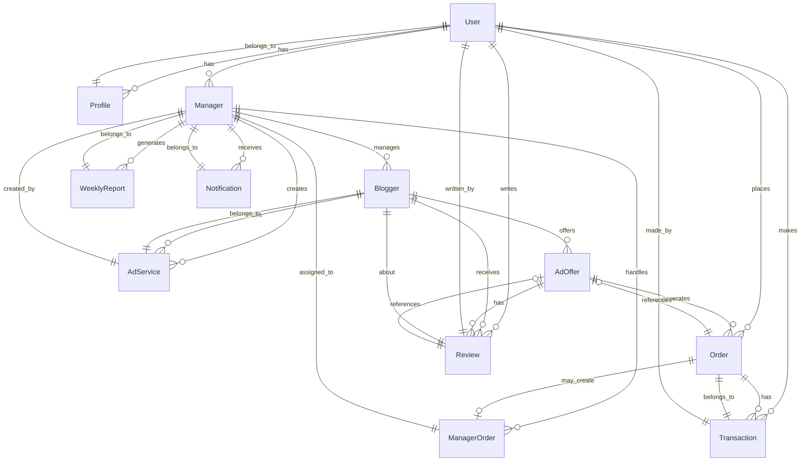

# ER-диаграмма (Логическая модель) системы SanderStu

## Описание сущностей и связей

### Пользовательские сущности

#### User (Пользователь)
- **Основные поля:** username, email, password, first_name, last_name
- **Связи:** 
  - 1:1 с Profile
  - 1:1 с Manager (опционально)
  - 1:N с Order
  - 1:N с Review
  - 1:N с Transaction

#### Profile (Профиль пользователя)
- **Основные поля:** full_name, birth_year, role, card_last4
- **Связи:**
  - N:1 с User (OneToOne)

#### Manager (Менеджер)
- **Основные поля:** phone, department, hire_date, is_active
- **Связи:**
  - N:1 с User (OneToOne)
  - 1:N с Blogger
  - 1:N с AdService
  - 1:N с ManagerOrder
  - 1:N с WeeklyReport
  - 1:N с Notification

### Содержимое

#### Blogger (Блоггер)
- **Основные поля:** name, social_network, topic, audience_size
- **Связи:**
  - N:1 с Manager
  - 1:N с AdOffer
  - 1:N с AdService
  - 1:N с Review

#### AdOffer (Рекламное предложение)
- **Основные поля:** title, description, price, social_network, is_active
- **Связи:**
  - N:1 с Blogger
  - 1:N с Order
  - 1:N с Review

#### AdService (Рекламная услуга)
- **Основные поля:** name, social_network, price, description, is_active
- **Связи:**
  - N:1 с Manager
  - N:1 с Blogger

### Заказы

#### Order (Заказ)
- **Основные поля:** order_type, status, payment_status, payment_amount, full_name, email, phone, budget
- **Связи:**
  - N:1 с User
  - N:1 с AdOffer
  - 1:N с ManagerOrder
  - 1:N с Transaction

#### ManagerOrder (Заказ менеджера)
- **Основные поля:** order_type, status, client_name, client_email, client_phone, service_description, budget
- **Связи:**
  - N:1 с Manager
  - N:1 с Order

### Вспомогательные сущности

#### WeeklyReport (Еженедельный отчет)
- **Основные поля:** week_start, week_end, total_orders, total_revenue, active_services
- **Связи:**
  - N:1 с Manager

#### Notification (Уведомление)
- **Основные поля:** notification_type, title, message, is_read
- **Связи:**
  - N:1 с Manager

#### Transaction (Транзакция)
- **Основные поля:** amount, type, payload
- **Связи:**
  - N:1 с Order
  - N:1 с User

#### Review (Отзыв)
- **Основные поля:** rating, text
- **Связи:**
  - N:1 с User
  - N:1 с Blogger
  - N:1 с AdOffer

## Типы связей

### One-to-One (1:1)
- User ↔ Profile
- User ↔ Manager

### One-to-Many (1:N)
- Manager → Blogger
- Manager → AdService
- Manager → ManagerOrder
- Manager → WeeklyReport
- Manager → Notification
- Blogger → AdOffer
- Blogger → AdService
- Blogger → Review
- AdOffer → Order
- AdOffer → Review
- User → Order
- User → Review
- User → Transaction
- Order → Transaction
- Order → ManagerOrder

### Many-to-One (N:1)
- Profile → User
- Manager → User
- Blogger → Manager
- AdOffer → Blogger
- AdService → Manager, Blogger
- Order → User, AdOffer
- ManagerOrder → Manager, Order
- WeeklyReport → Manager
- Notification → Manager
- Transaction → Order, User
- Review → User, Blogger, AdOffer

