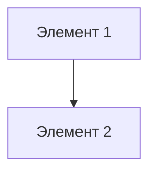

# Диаграммы системы SanderStu

Этот каталог содержит документацию и диаграммы системы SanderStu.

## Содержание

### 📋 Общее описание
- **[SYSTEM_DESCRIPTION.md](./SYSTEM_DESCRIPTION.md)** - Полное описание системы, роли пользователей, API, база данных

### 📊 Диаграммы

#### 1. Диаграмма классов
**Файл:** [CLASS_DIAGRAM.md](./CLASS_DIAGRAM.md)

Описание основных классов системы и их отношений:
- User, Profile, Manager
- Blogger, AdOffer, AdService
- Order, ManagerOrder
- Review, WeeklyReport, Notification

**Используется для:** понимания структуры классов и их взаимодействия

#### 2. ER-диаграмма (Логическая модель)
**Файл:** [ER_DIAGRAM.md](./ER_DIAGRAM.md)

Entity-Relationship диаграмма с описанием:
- Всех сущностей системы
- Отношений между сущностями (1:1, 1:N, N:M)
- Основных полей каждой сущности

**Используется для:** проектирования базы данных и понимания связей данных

#### 3. Структурная схема
**Файл:** [SYSTEM_ARCHITECTURE.md](./SYSTEM_ARCHITECTURE.md)

Архитектурная диаграмма системы с описанием:
- Слоев приложения (Frontend, API, Business Logic, Data)
- Компонентов каждого слоя
- Потоков данных
- Технологий

**Используется для:** понимания архитектуры и развёртывания системы

#### 4. DevOps диаграмма
**Файл:** [DEVOPS_DIAGRAM.md](./DEVOPS_DIAGRAM.md)

DevOps и инфраструктурная диаграмма с описанием:
- Docker контейнеров и их взаимодействия
- Volumes и хранения данных
- Процесса сборки и развертывания
- Переменных окружения
- Команд для управления контейнерами

**Используется для:** развертывания, отладки и управления инфраструктурой

#### 5. Логическая модель данных
**Файл:** [LOGICAL_DATA_MODEL.md](./LOGICAL_DATA_MODEL.md)

Детальная логическая модель данных с описанием:
- Все таблицы и их атрибуты
- Типы данных PostgreSQL
- Ограничения целостности (CHECK, NOT NULL, UNIQUE)
- Индексы для оптимизации
- Связи между таблицами
- Нормализация

**Используется для:** понимания структуры БД, миграций, оптимизации запросов

## Как использовать

### Для разработчиков
1. Начните с **[SYSTEM_DESCRIPTION.md](./SYSTEM_DESCRIPTION.md)** для общего понимания
2. Изучите **[CLASS_DIAGRAM.md](./CLASS_DIAGRAM.md)** для структуры кода
3. Посмотрите **[ER_DIAGRAM.md](./ER_DIAGRAM.md)** для понимания БД
4. Изучите **[LOGICAL_DATA_MODEL.md](./LOGICAL_DATA_MODEL.md)** для деталей БД
5. Изучите **[SYSTEM_ARCHITECTURE.md](./SYSTEM_ARCHITECTURE.md)** для архитектуры
6. Используйте **[DEVOPS_DIAGRAM.md](./DEVOPS_DIAGRAM.md)** для развертывания и Docker

### Для менеджеров проекта
- **[SYSTEM_DESCRIPTION.md](./SYSTEM_DESCRIPTION.md)** - краткое описание
- **[SYSTEM_ARCHITECTURE.md](./SYSTEM_ARCHITECTURE.md)** - техническая архитектура

### Для дизайнеров
- **[CLASS_DIAGRAM.md](./CLASS_DIAGRAM.md)** - данные и их структура
- **[ER_DIAGRAM.md](./ER_DIAGRAM.md)** - связи между сущностями

## Формат диаграмм

Все диаграммы созданы в формате **Mermaid**, который поддерживается:
- GitHub (автоматическое отображение)
- GitLab
- VS Code (через расширение)
- Онлайн редакторах (mermaid.live)

### Просмотр диаграмм

1. **На GitHub/GitLab** - просто откройте файл .md
2. **В VS Code** - установите расширение "Markdown Preview Mermaid Support"
3. **Онлайн** - скопируйте код Mermaid на https://mermaid.live

## Создание новых диаграмм

Если вы хотите добавить новую диаграмму:

1. Создайте файл `.md` в этой папке
2. Используйте формат Mermaid для диаграмм
3. Добавьте описание в этот README

### Пример создания диаграммы

````markdown
# Моя новая диаграмма



Описание диаграммы...
````

## Связь с кодом

Диаграммы основаны на реальных моделях Django:
- `accounts/models.py`
- `bloggers/models.py`
- `managers/models.py`
- `ads/models.py`
- `shop/models.py`

При изменении моделей не забудьте обновить соответствующие диаграммы.

