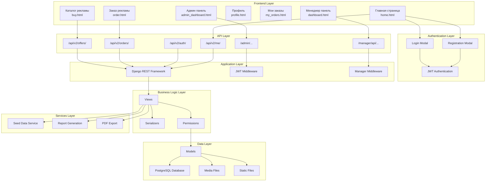

# Структурная схема системы SanderStu

## Архитектурные слои

### 1. Frontend Layer (Слой представления)

#### Пользовательские страницы
- **Главная страница** (`home.html`) - главная страница с баннерами и предложениями
- **Каталог рекламы** (`buy.html`) - список доступных рекламных предложений
- **Заказ рекламы** (`order.html`) - форма для создания персонального заказа
- **Профиль** (`profile.html`) - профиль пользователя
- **Мои заказы** (`my_orders.html`) - история заказов пользователя

#### Панели управления
- **Админ панель** (`admin_dashboard.html`) - административная панель
- **Менеджер панель** (`dashboard.html`) - панель менеджера

#### Модальные окна
- **Login Modal** - окно входа в систему
- **Registration Modal** - окно регистрации

### 2. Authentication Layer (Слой аутентификации)

- **JWT Authentication** - токен-аутентификация через JWT
- Проверка прав доступа для различных ролей
- Автоматическое обновление токенов

### 3. API Layer (Слой API)

#### Публичные эндпоинты
- `/api/v2/offers/` - список рекламных предложений
- `/api/v2/orders/` - управление заказами
- `/api/v2/auth/` - аутентификация
- `/api/v2/me/` - информация о текущем пользователе

#### Административные эндпоинты
- `/admin/...` - административная панель
- `/manager/api/...` - API для менеджеров

### 4. Application Layer (Слой приложения)

#### Django REST Framework
- **Views** - представления API
- **Serializers** - сериализация данных
- **Permissions** - управление правами доступа

#### Middleware
- **JWT Middleware** - проверка JWT токенов
- **Manager Middleware** - специфичная логика для менеджеров

### 5. Business Logic Layer (Слой бизнес-логики)

- **Views** - бизнес-логика в представлениях
- **Serializers** - валидация и преобразование данных
- **Permissions** - контроль доступа на уровне запросов

### 6. Data Layer (Слой данных)

#### Модели (Models)
- **User** - пользователь
- **Profile** - профиль пользователя
- **Manager** - менеджер
- **Blogger** - блоггер
- **AdOffer** - рекламное предложение
- **AdService** - рекламная услуга
- **Order** - заказ
- **ManagerOrder** - заказ менеджера
- **Review** - отзыв
- **WeeklyReport** - еженедельный отчет
- **Notification** - уведомление

#### Хранилища
- **PostgreSQL Database** - основная база данных
- **Media Files** - медиа-файлы (изображения, PDF)
- **Static Files** - статические файлы (CSS, JS)

### 7. Services Layer (Слой сервисов)

- **Seed Data Service** - загрузка начальных данных
- **Report Generation** - генерация отчетов
- **PDF Export** - экспорт в PDF

## Потоки данных

### Пользовательский поток
1. Пользователь открывает главную страницу
2. Выбирает "Купить рекламу" → попадает в каталог
3. Нажимает "Заказать" → открывается форма заказа
4. Заполняет форму и отправляет
5. Заказ создается в БД
6. При персональном заказе создается ManagerOrder
7. Менеджер видит заказ в своей панели
8. Менеджер принимает/отклоняет заказ

### Поток менеджера
1. Менеджер входит в систему
2. Редирект на `/manager/`
3. Менеджер видит вкладки: Услуги, Блоггеры, Персональные заказы, Отчёты, Профиль
4. Менеджер управляет заказами, создает услуги, генерирует отчёты

### Поток администратора
1. Администратор входит в систему
2. Редирект на `/admin-panel/`
3. Просмотр статистики, управление пользователями, заказами

## Технологический стек

### Backend
- **Django 5.2.6** - основной фреймворк
- **Django REST Framework** - API фреймворк
- **JWT** - аутентификация
- **PostgreSQL** - база данных
- **ReportLab** - генерация PDF

### Frontend
- **HTML5/CSS3/JavaScript** - клиентская часть
- **Bootstrap** - UI фреймворк
- **Vanilla JS** - взаимодействие с API

### DevOps
- **Docker** - контейнеризация
- **Docker Compose** - оркестрация контейнеров

